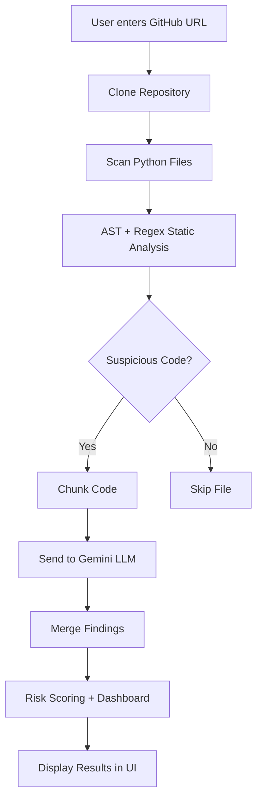
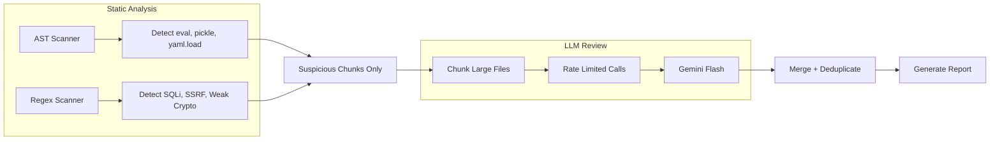

# AI Code Review Agent

**An intelligent, production-grade AI-powered code review system** that combines **AST-based static analysis**, **regex security scanning**, and **Gemini LLM review** to detect vulnerabilities, bad practices, and security risks in Python repositories.


---

## Features

- Real-time VS Code-style terminal with live logs
- AST + Regex pre-scanning before LLM analysis
- Automatic detection of dangerous patterns (`eval`, `pickle.loads`, `yaml.load`, SSRF, SQLi, etc.)
- GitHub-style issue cards with expandable details
- Interactive file explorer in sidebar
- Visual risk scoring + severity dashboard
- Rate-limit resilient Gemini integration with retries
- Modern dark-themed UI with progress indicators

---

## Architecture

### High-Level Flow



### Detailed Analysis Pipeline



---

## Tech Stack

| Component              | Technology                     |
|------------------------|--------------------------------|
| Frontend               | Streamlit                      |
| Backend                | Python 3.10                    |
| LLM                    | Google Gemini Flash            |
| Static Analysis        | AST + Custom Regex             |
| Terminal               | Custom HTML + Live Logging     |
| Visualization          | Plotly                         |
| Version Control        | GitPython + subprocess         |

---

## Installation

```bash
git clone https://github.com/yourusername/ai-code-review-agent.git
cd ai-code-review-agent

pip install -r requirements.txt
```

**Requirements:**
- Python 3.10+
- Gemini API Key (free tier works)

---

## Usage

1. Run the app:
   ```bash
   streamlit run app.py
   ```

2. Enter any public GitHub repository URL (e.g. `https://github.com/adeyosemanputra/pygoat`)

3. Click **Run Review**

4. Watch the live terminal while the agent:
   - Clones the repo
   - Runs AST + Regex analysis
   - Sends suspicious code to Gemini
   - Displays rich issue cards and dashboard

---

## Example Output

- **80 files scanned**
- **10 real issues found**
- **Risk Score: 61/100**
- Detected: `eval()`, `pickle.loads()`, SSRF, SQL Injection patterns

---

## Project Structure

```
ai-code-review-agent/
├── app.py                    # Main Streamlit UI
├── terminal_logger.py        # Live terminal logging system
├── services/
│   ├── repo_loader.py        # Git cloning + streaming
│   ├── file_parser.py        # AST + Regex scanners
│   ├── pipeline.py           # Full analysis orchestration
│   └── llm_reviewer.py       # Gemini integration + retries
├── requirements.txt
├── .env                      # GEMINI_API_KEY
└── README.md
```

---

## Future Roadmap

- Export reports (PDF / Markdown)
- Multi-language support (Java, JS, Go)
- CVE database integration
- Monaco editor for code preview
- Severity heatmap visualization

---

## License

MIT License

---

*Built with ❤️ using Streamlit + Gemini*